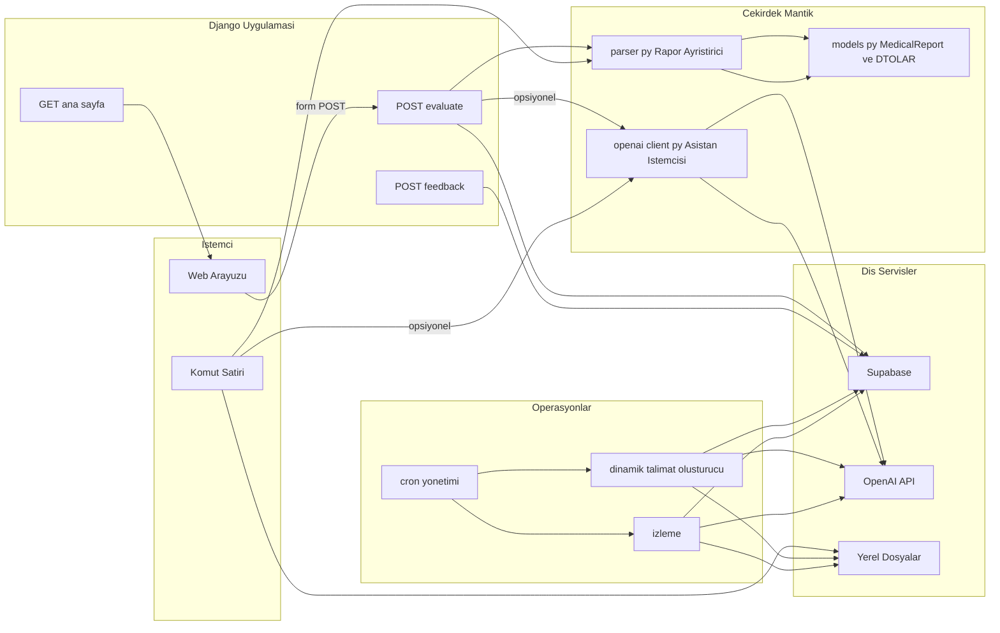
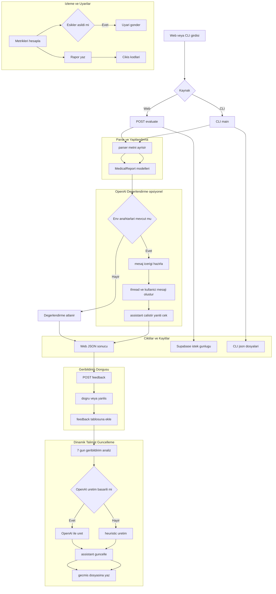

## Hünerdeneme - Sistem Mimarisi ve İş Akışları

Bu doküman, depo içeriğinden otomatik çıkarılan yüksek seviyeli mimariyi ve uçtan uca iş akışlarını içerir. Diyagramlar Mermaid sözdizimi ile verilmiştir ve GitHub üzerinde doğrudan görüntülenebilir.

### 1) Yüksek Seviye Mimarî

### 2) Uçtan Uca İş Akışı

### 3) HTTP Uç Noktaları
- GET `/` → `index.html`
- POST `/evaluate/` → `{ structured, assistant }`
- POST `/feedback/` → `{ ok: true }` ya da hata açıklaması

### 4) Ortam Değişkenleri (kritik)
- `OPENAI_API_KEY`, `OPENAI_ASSISTANT_ID`
- `SUPABASE_URL`, `SUPABASE_SERVICE_KEY` (veya `SUPABASE_KEY`)
- (Monitoring) `ALERT_EMAIL_*`, `TELEGRAM_*`
- (Django) `DJANGO_SECRET_KEY`, `DJANGO_DEBUG`, `DJANGO_ALLOWED_HOSTS`, `DJANGO_CSRF_TRUSTED_ORIGINS`

Bu dosya, deponun mevcut kodlarından otomatik çıkarılmıştır ve değişikliklerle birlikte güncellenmelidir.

